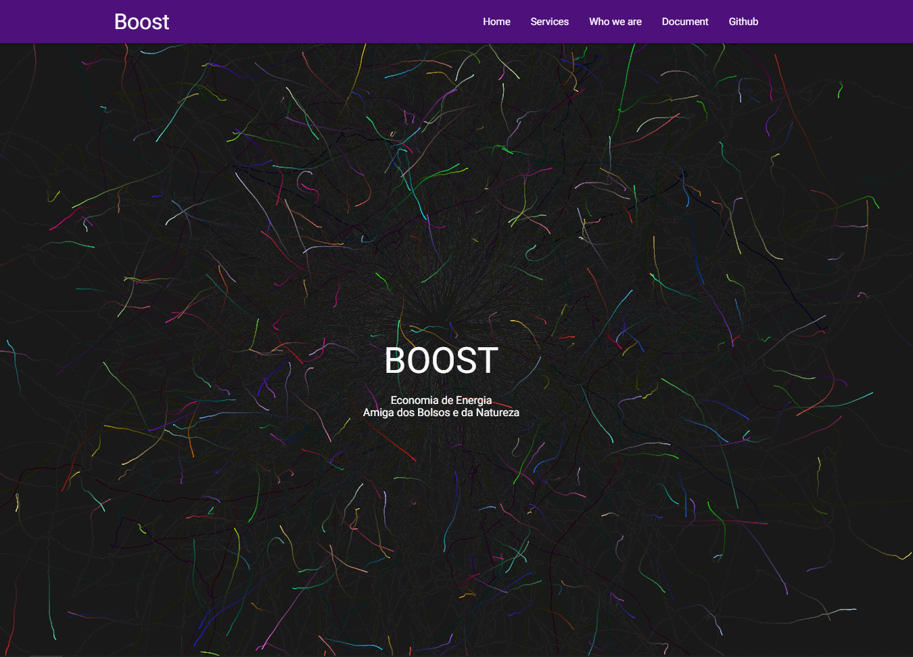
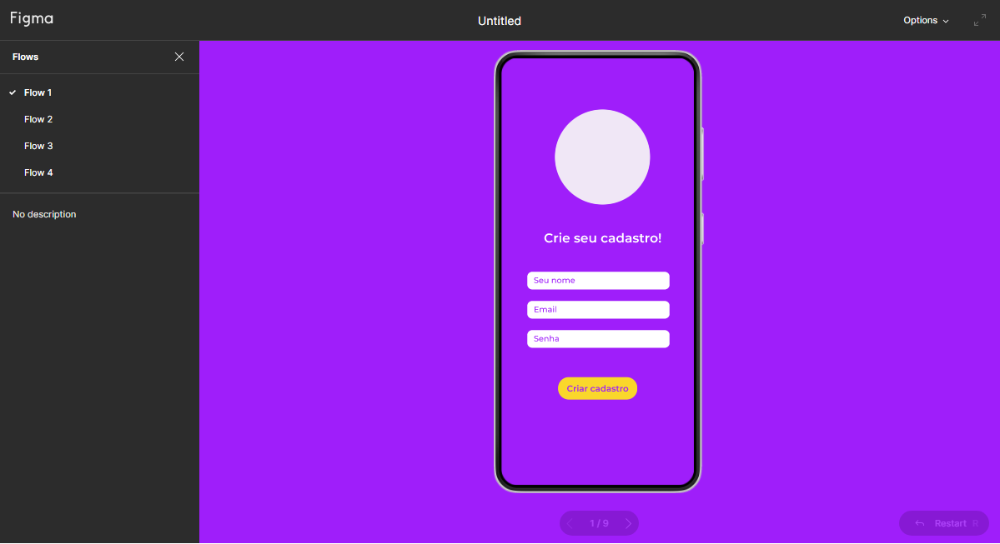

# IHC Landing Page 

### [Original Project](https://github.com/nordicgiant2/cool-landing)
##

### [DEMO](https://gustavomartinx.github.io/Human-Computer-Interaction/)





# About [`particles-bg`](https://github.com/lindelof/particles-bg) library
#### This project uses the react particle background component library [https://github.com/lindelof/particles-bg](https://github.com/lindelof/particles-bg). It's very simple. Anyone can be a Musketeer with it.


## About gh-pages
About gh-pages you can check here for more information. [https://pages.github.com/](https://pages.github.com/).

## Run Project
### 1. Clone the project
```
git clone https://github.com/nordicgiant2/gh-pages-theme
```

### 2. Run the project
```shell
npm i
npm start
```

### 3. Build
```shell
npm run build
```
